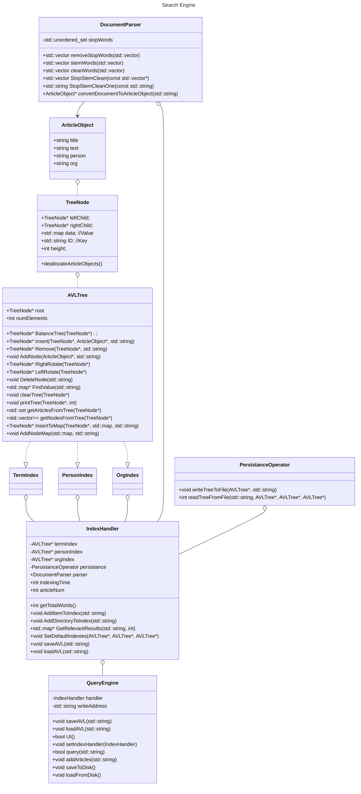

# Assignment 4: Answers

**Complete this document, commit your changes to Github and submit the repository URL to Canvas.** Keep your answers short and precise.

Names of all team members:

1. Cooper Shapard
2. None
3. None


Used free extension: [ ] 24 hrs or [ ] 48 hrs

[x] Early submission (48 hrs)

## NOTE: I was trying to copy my code to a new repo to test things out, and I accidentally committed to the original, not the copy. If you check the commit history, you'll see that the only new code in the commits are adding the License and this message explaining the situation. Please forgive my error, as I originally did submit the assignment before the 48 hour mark, and I would like the 5 extra points. Thank you for your understanding.

[x] Bonus work. Describe: See [Bonus Work](#bonus-work)

## Answers

### Project Management

Weekly milestones/tasks. Set out a plan at the beginning and then record when you got it done.

| Task        | Planned completion | Actual completion | Time spent in hrs by Cooper |
| ----------- | :-----------------:| :---------------: | :-------------------------: |
| Class Diagram| April 3              | April 3             | 0.5                       |
| Class Description           | April 5              |  April 5         |    0.5                  |
| Submit Design Doc           | April 6           |   April 5       |    0.5                  |
| Finish ResultItem, <br>DocumentParser, <br>AVLTree, and TreeNode <br>classes           |     April 10          |  April 11            |    6.0                     |
| AVLTree tests and <br> Submit Map Assignment            | April 12              |   April 13         |         1.0                 | 
| Finish Indexies, <br>Index Handler, and <br>Persistance Operator <br>classes           | April 16              |  April 16           |   3.5                      |
| Finish Query Engine           | April 20              |  April 18           |    4.0                     |
| Optimize System           | April 22              |    April 23          |     2.0                    |
| Final Testing/Documentation           | April 24              |     April 25         |   2.0                       |
| Submit Finalized Project           | April 25             |      April 26        |     0                   |

Total Time Spent: ~19 hours


### High-level Design of Solution

- UML Class Diagram (if it doesn't automatically render in your IDE, copy and paste the code into https://mermaid.live/ . Classes are at the top and associations are at the bottom):

- High-level pseudo code for each component.

### Used Data Structures
1. AVL Tree
    1. I used the AVL Tree as the main component for indexing terms, people, and organizations. It works by creating a tree structure ordered alphabetically and automatically balancing the nodes after each insertion or deletion. The AVL Tree was chosen because it is efficient and scales well.
    2. Both adding and fetching nodes from the tree is a O(log(n)) operation.
    3. This structure is appropriate because it is fast, scales well, and can quickly be expanded/appended to if needed. Other appropriate structures inlude Tries and Hashmaps.
2. std::map\<ArticleObject* article, int relevancy\>
    1. I used a Map to store the data for each TreeNode, mapping the Article's information to it's relevancy within the given term/node. I chose a map because it is easy to implement with the standard template library, has O(log(n)) lookup, and allows for each term/node to have different relevancies for the same documents.
    2. The STL map is implemented as a Red-Black Tree, so it has insertion and lookup times of O(log(n)).
    3. This data structure is appropriate because it works very quickly with small sets, holds multiple data points, and is friendly with memory allocation. Other usable structures include a vector, a seperate AVL Tree, or a hashmap.
3. std::vector\<std::string\>
    1. I used this data structure to hold the list of words from each article while they wait to be parsed. I chose it because it is easy to implement, allows for duplicate values (beneficial for relevancy rankings), and is optimized with the STL.
    2. Getting an item from an index is O(1), adding an item to the vector us usually O(1), but occationally O(n) when it needs to be resized, and searching a vector is O(n).
    3. This structure is appropriate because it is relatively quick (I only use it when I need O(n) anyways, like looping through every word), optimized with STL, and contains all the necessary features. Other possible structures include a map (word : occurances) and a dynamically allocated array.

### User Documentation
- What are the features of your software?
    - SuperSearch Engine is a high-speed indexing and query software that allows a user to construct a search interface from a given corpus. It includes many features such as CLI assistance, time reporting for both indexing and querying, and the ability to read and write the index to and from memory for quickly picking up where you left off. Optimized for search speed and article relevancy, SuperSearch Engine is sure to get you the information you need when you need it.
- Describe how to use the software.
    - The preferred way to interact with SuperSearch Engine is using its built-in user interface, which can be accessed by running `supersearch ui` from your terminal. Here, a clean interface will guide you through the process of creating an index and searching for terms. There is also a convenient way to display statistics about your corpus, which can give you information about how many unique words and articles are in your system. Queries can be performed by simply typing in the text that you want to search for, each word seperated by a space. It is case insensitive and finds all relevant words, so you don't have to worry about cleaning your inputs on your own. SuperSearch Engine also provides a way to directly search for People and Organizations within each article. Simply preface your desired name with `PERSON:` for people and `ORG:` for organizations to fine tune your results. You can also prevent a certain word from appearing in your results by prefacing the term with a `-`. 
    - For the technical wizzes out there, we also offer a more streamlined way to interact with SuperSearch Engine through the CLI. To create an index from a directory, run `supersearch index <relative_path_to_directory>`, which will index all your words and save the results to a special file called "supersearch.corpus". To search from that same corpus, simply run `supersearch query "YOUR TERMS HERE"`, which will efficiently load the tree from supersearch.corpus into memory and perform the query. If you would like to perform more than one query without having to reload the tree each time, consider using the built in UI, which supports multi-querying.
- Some example queries with the results.
    - For the search term "German" in one of the data subsets, here is an example of the results:
    ```
    2078 articles found for "German". Search took 8 milliseconds
    Search Results: 
        0. Return to menu
        1. German American Bancorp, Inc. and First Security, Inc. Announce Definitive Merger Agreement
        2. Trump trade threat looms large as Merkel heads to China
        3. Exposed and dependent - Germany desperate to avoid trade war
        4. Exposed and dependent: Germany desperate to avoid trade war
        5. German American Bancorp, Inc. (GABC) Reports Record Quarterly Earnings
        6. Germany’s Liberal Bishops Gain Influence Under Pope Francis
        7. German industrial output rises more than expected
        8. German official voices concern over limits on foreign press in China
        9. The Latest: France's Macron speaks with Iranian president
        10. The Latest: Turkey: US pullout from Iran deal worrying
        11. The Latest: Trump defends Iran nuclear deal withdrawal
        12. German regulator says Geely's Daimler stake needed earlier disclosure - report
        13. The Latest: Macron calls US exit from Iran deal a 'mistake'
        14. German soccer stars under fire for posing with Turkey's Erdogan
        15. 'Just a blip' - German growth slows in first quarter on weak trade
    
    > 
    ```
    - Selecting the #1 option will output the title, author, date, and full text of the article as below (shortened for viewing convenience):
    ```
    German American Bancorp, Inc. and First Security, Inc. Announce Definitive Merger Agreement
    cnbc.com
    2018-05-23

    JASPER, Ind., May 22, 2018 (GLOBE NEWSWIRE) -- German American Bancorp, Inc. (Nasdaq:GABC) ("German American") and First Security, Inc. (OTCQX:FIIT) ("First Security") announced today that ...
    ... Merger, as well as other statements of expectations regarding the Merger, and other statements of German American’s goals, intentions and expectations.
    ```
    - Similarly, a search for "Virtual Food PERSON:Jay PERSON:Samit" will produce:
    ```
    3764 articles found for "Virtual Food PERSON:Jay PERSON:Samit". Search took 4 milliseconds
    Search Results: 
        0. Return to menu
        1. How Amazon Is Using Whole Foods in a Bid for Total Retail Domination
        2. Virtual Food Is Coming to a Menu Near You
        3. Galaxy Entertainment Group Announces Selected Unaudited Q1 Financial Data
        4. Smithfield Foods Releases Animal Care Section of 2017 Sustainability Report, New Virtual Reality Video of Hog Operations
        5. Tyson Foods Delivers Earnings Growth in First Six Months, Reaffirms Guidance for Another Record Year
        6. EAT Club Acquires Farm Hill's Personal Meal Business to Fuel Growth of Corporate Lunch Delivery Service
        7. Recall Release 038-2018 Misbranding and an Undeclared Allergen
        8. Rebooting food: Finding new ways to feed the future
        9. HORMEL FOODS CORPORATION RECALLS CANNED PORK AND CHICKEN PRODUCTS DUE TO POSSIBLE FOREIGN MATTER CONTAMINATION
        10. Whole Foods' Mama's One Sauce is a Harlem favorite
        11. RUIZ FOOD PRODUCTS, INC. RECALLS 12-COUNT FROZEN BREAKFAST BURRITOS DUE TO POSSIBLE FOREIGN MATTER CONTAMINATION
        12. Amazon plans more Prime perks at Whole Foods, and it will change the industry
        13. More businesses are mellowing out over hiring marijuana smokers due to labor shortage
        14. Here are the high-paying jobs going empty right now
        15. Del Taco looks beyond the after-party crowd to feed professional night owls
    
    >
    ```
    - Viewing option #15 displays:
    ```
    Del Taco looks beyond the after-party crowd to feed professional night owls

    2018-05-04

    Retail Report Del Taco looks beyond the after-party crowd to feed professional night owls Del Taco is launching new late-night menu items at the end of the month to cater to the after-hours crowd...
    ...fast food late at night and into the small hours of the morning."
    ```


### Performance
Stats for all 300,000 articles in the dataset:
- Indexing from JSON Time: 1825 seconds (30 minutes, 25 seconds)
- Indexing from Persistance Time: 495 seconds (8 minutes, 15 seconds)
- Writing to Persistance Time: 2205 seconds (36 minutes, 45 seconds)
- Total Articles: 306,242
- Total Unique Terms/TreeNodes: 1,273,590
- Average Search Speed: 65 milliseconds

### Bonus Work
Did you attempt any bonuses? If so, please give a brief description of what you did.

1. Implementation of very smart relevancy ranking ideas (up to +2). I designed an algorithm that favors articles with all the requested terms, but assigns them a specific relevancy based on number of occurances if not.
2. Indexing and Query Speed (up to +10). For the 306,000 articles in the provided dataset, it takes about 30 minutes to index them all from scratch, but only about 8 minutes to load them all from a .corpus file (since I designed it to be more efficient). My query speeds are in the 10's of microseconds for small datasets and in the 10's of milliseconds for large sets like the whole 306,000 article dataset. I believe that will rank me highly for at least the Query Speed bracket, and possibly the Indexing Speed (for a smaller dataset).
