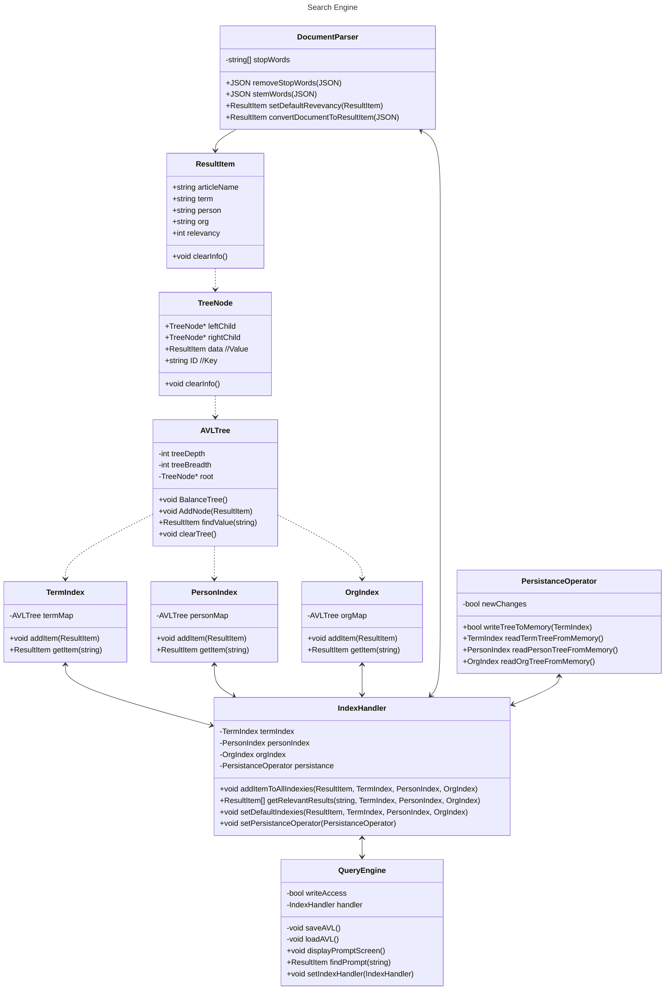
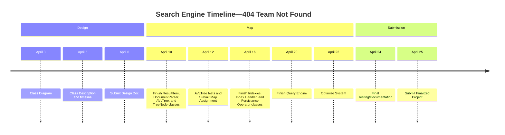

# Coding Assignment 4: Search Engine (Design)
## Team: 404 Team Not Found

1. A first UML diagram. [3]

Made with Mermaid.js. View at https://mermaid.live if it doesn't automatically render with your text editor.

2. A description of what each class does and what data structures it uses. [3]

| Class | Description | Data Structures/Attributes |
|---|---|---|
| ResultItem | A class used to store lot's of information about an article. The lowest packet of information in my system| None |
| TreeNode | A single node in the AVL tree to be used in the AVLTree class. Has key and value attributes. | Map |
| AVLTree | A basic AVL tree with balancing functionalities. | Tree |
| TermIndex/ PersonIndex/ OrgIndex | The inverted file index for each type of query. Simplifies the AVLTree class. | Tree |
| IndexHandler | Requests and pushes information to the specified Indexies. Can return an array of the keys sorted by relevancy | Array |
| DocumentParser | Cleans and processes data for input into the IndexHandler | RapidJSON |
| QueryEngine | The main user control unit for the system. Allows for simplified function calls and control. | None |
| PersistanceOperator | Loads and stores a standardized format  of the AVL tree to and from memory | File Handling |

3. A short description of how the classes interact with each other to create an index and perform a query. [2]

- In this system, the user starts off by creating an index with a directory of data. This goes through the QueryEngine to the IndexHandler, which puts each document through the document parser, which cleans the data and turns it into ReturnItems. These ReturnItems are then sorted into their appropriate AVLTree Index (Item, Person, or Org) and assigned a relevancy. To perform a request/query, the user inputs a request through the QueryEngine, which asks the IndexHandler for the specified data. The IndexHander goes through the desired Indexies and finds all matching results, puts them in an array sorted by relevancy, which is sent back to be displayed by the user. The QueryEngine can also submit a request for the AVL tree to be stored/loaded from a standardized format using the PersistanceOperator, but only if the user has writeAccess to the data.

4. A timeline for implementing the different pieces with the projected completion date for each component. [2]

